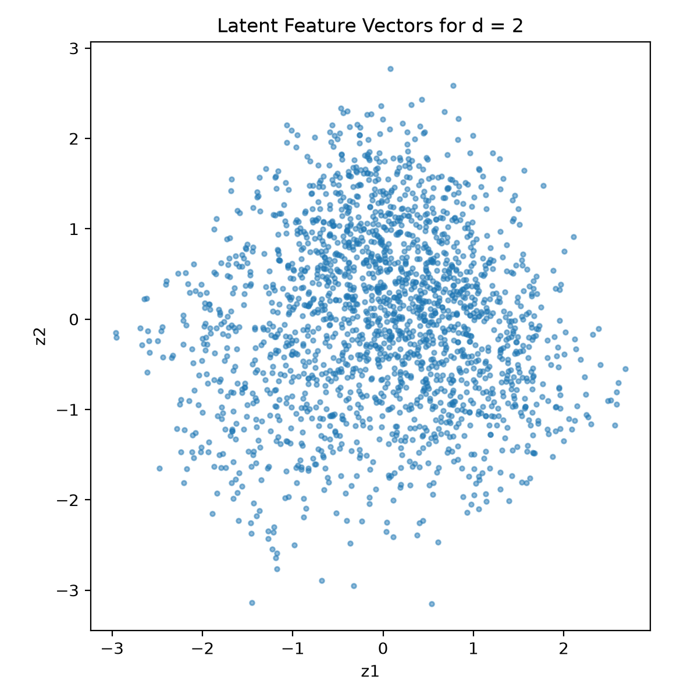
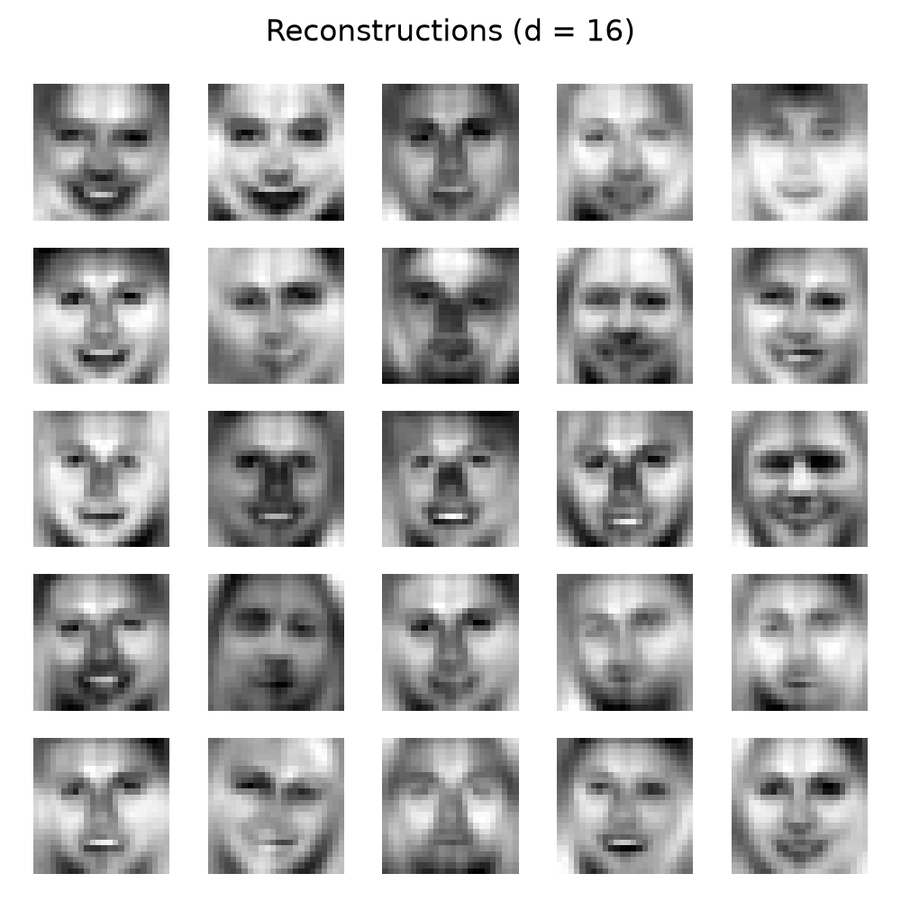
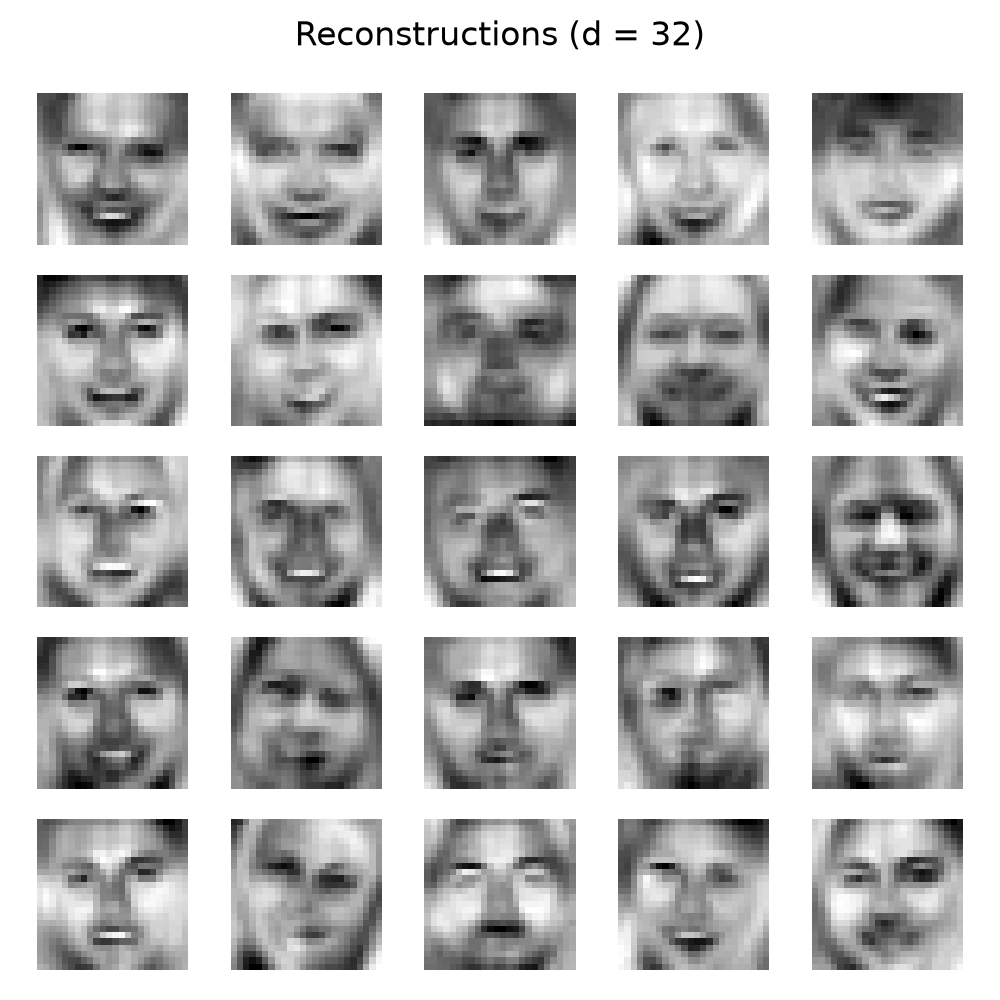
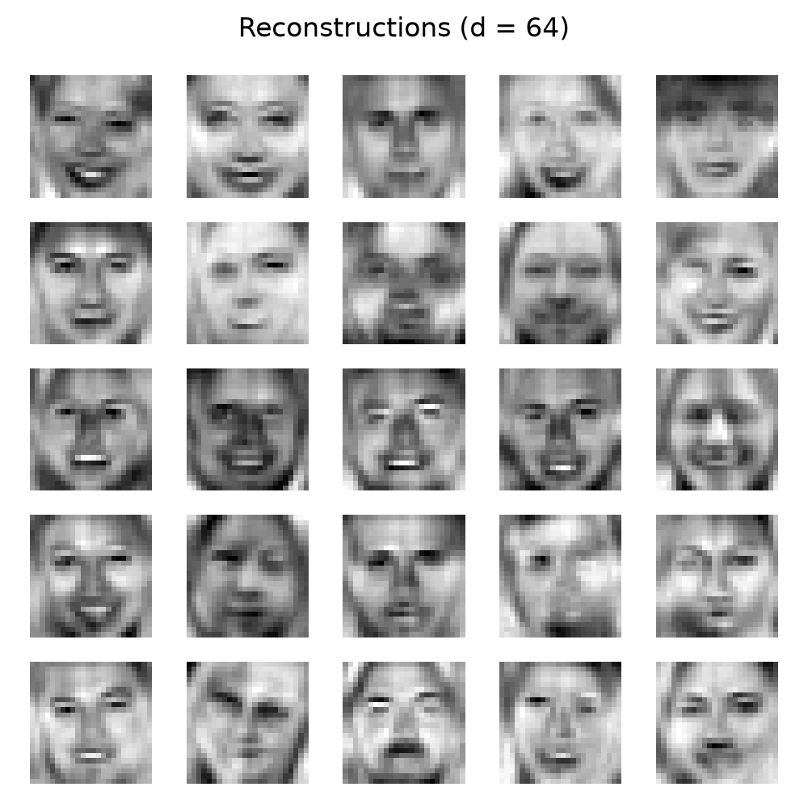
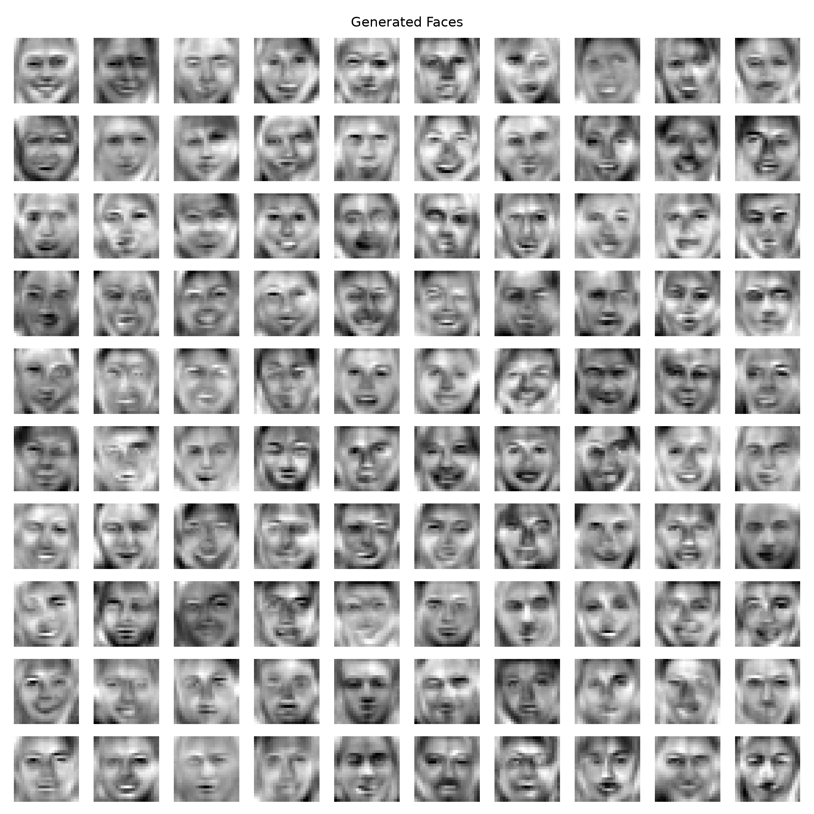
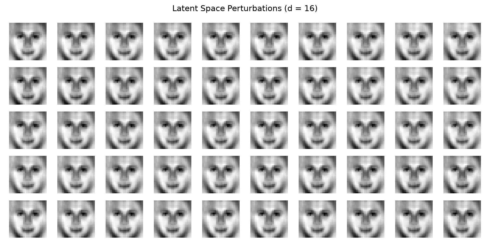

# Probabilistic PCA for Eigenfaces

This project implements **Probabilistic Principal Component Analysis (p-PCA)** on a dataset of 24×24 grayscale face images. The model learns a low-dimensional latent representation of faces and uses it for visualization, image reconstruction, face generation, and latent space exploration.

## Overview

Each face image is represented as a vector:

\[
x \in \mathbb{R}^{576}
\]

since each image has \(24 \times 24 = 576\) pixels.

Probabilistic PCA assumes that an observed image \(x\) is generated from a lower-dimensional latent variable \(z\):

\[
p(z) = \mathcal{N}(0, I)
\]

\[
p(x|z) = \mathcal{N}(Wz + \mu, \sigma^2I)
\]

where:

- \(z\) is the latent feature vector
- \(W\) maps the latent space to the image space
- \(\mu\) is the mean face
- \(\sigma^2\) represents isotropic noise

The p-PCA parameters are estimated using maximum likelihood estimation (MLE).

## Project Tasks

### 1. p-PCA Training

The model computes the MLE parameters:

- Mean vector \(\mu\)
- Covariance matrix \(S\)
- Noise variance \(\sigma^2\)
- Projection matrix \(W\)

using eigendecomposition of the data covariance matrix.

### 2. Latent Space Visualization

For latent dimension \(d=2\), the posterior mean:

\[
E[z|x] = M^{-1}W^T(x-\mu)
\]

is computed for every training image and visualized in a two-dimensional scatter plot.

### 3. Image Reconstruction

Faces are reconstructed using the following process:

\[
x \rightarrow E[z|x] \rightarrow E[x|z]
\]

Reconstructions are generated for:

- \(d = 16\)
- \(d = 32\)
- \(d = 64\)

Increasing the latent dimension generally improves reconstruction quality because more variation in the original images can be represented.

### 4. Face Generation

New faces are generated by sampling latent vectors from:

\[
z \sim \mathcal{N}(0, I)
\]

and decoding them into image space:

\[
E[x|z] = Wz + \mu
\]

A collection of 100 generated faces is displayed in a 10×10 collage.

### 5. Latent Space Perturbation

A face is encoded into its latent representation and individual latent dimensions are perturbed.

For a latent vector:

\[
z = [z_1, z_2, ..., z_d]
\]

one dimension is modified while keeping the remaining dimensions fixed. The modified vector is then decoded to observe how changes in latent space affect the reconstructed face.

## Results

### Latent Space Scatter Plot (d = 2)



### Reconstructions

#### d = 16



#### d = 32



#### d = 64



### Generated Faces



### Latent Space Perturbations



## Project Structure

```text
.
├── eigenfaces_ppca.py
├── eigenfaces.npy
├── latent_scatter_d2.png
├── reconstructions_d16.png
├── reconstructions_d32.png
├── reconstructions_d64.png
├── generated_faces.png
├── perturbations_d16.png
├── .gitignore
└── README.md
